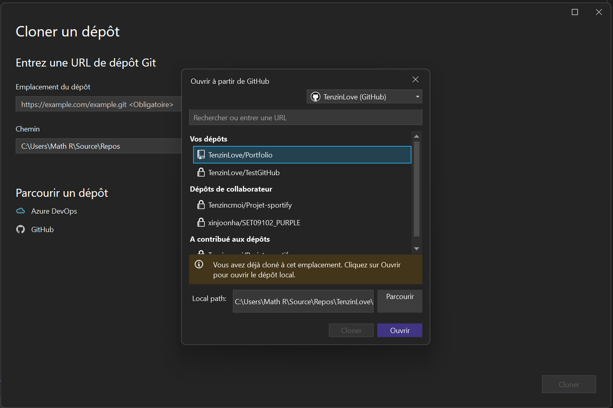
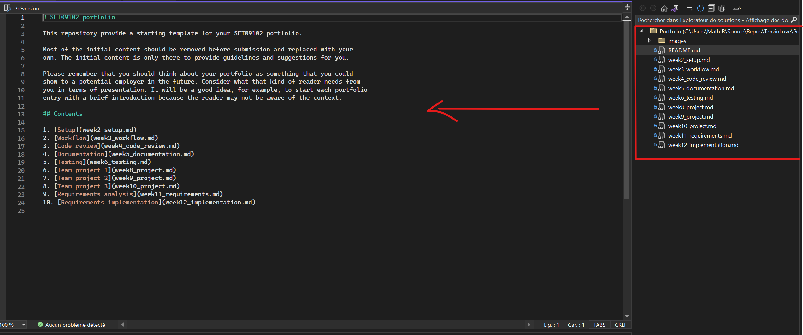

# Setup

In this section, I aim to set up Visual Studio to be able to control my GitHub (Portfolio) 
via Visual Studio.
So I've made some configurations in Visual Studio to achieve this.

## Environment configuration

After installing Visual Studio and its workloads, I started configuring GitHub on VS.

Firstly, I began by connecting my github account to VS.

I then tried to clone my GitHub "Portfolio" file in VS. So, after doing Git-> Repository Clone, 
we come across the following picture where I've selected my GitHub account and the folder.

We can now see that the Portfolio has been saved on the computer and that I can edit the texts.

Once this has been done, I create a commit and do Git->Push to send it to GitHub.

## Reflection

For this section, decide what points are worth making and structure your content 
appropriately.

**DO**

* Use sub-headings to differentiate between sections
* Provide <ins>reflective</ins> commentary that discusses, for example, limitations of
  your current configuration, how your configuration is appropriate for the current 
  project, alternative configuration that might be appropriate in ther circumstances, 
  etc.
* Mention any difficulties you had setting up your working environment and how you 
  resolved them

**DON'T**

* Repeat the descriptive commentary from point 1
* Give a blow-by-blow account of everything you did. Instead, you should highlight 
  the important points.
