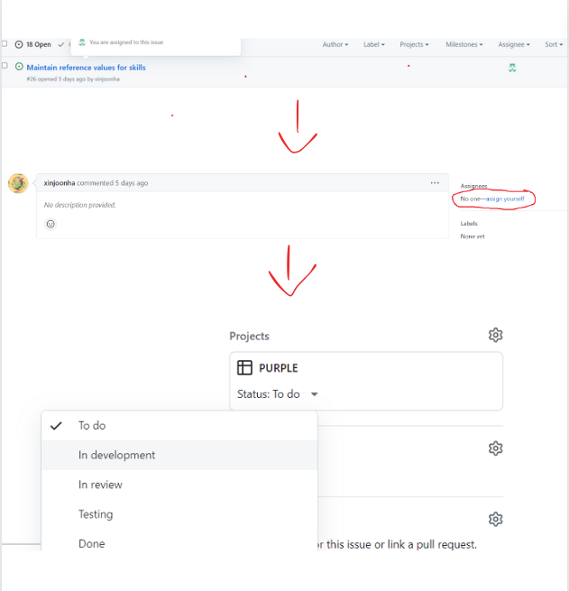
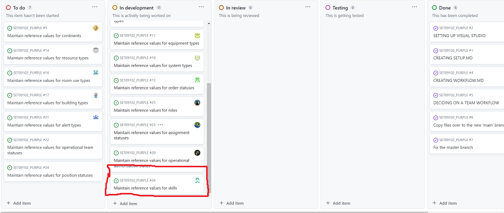
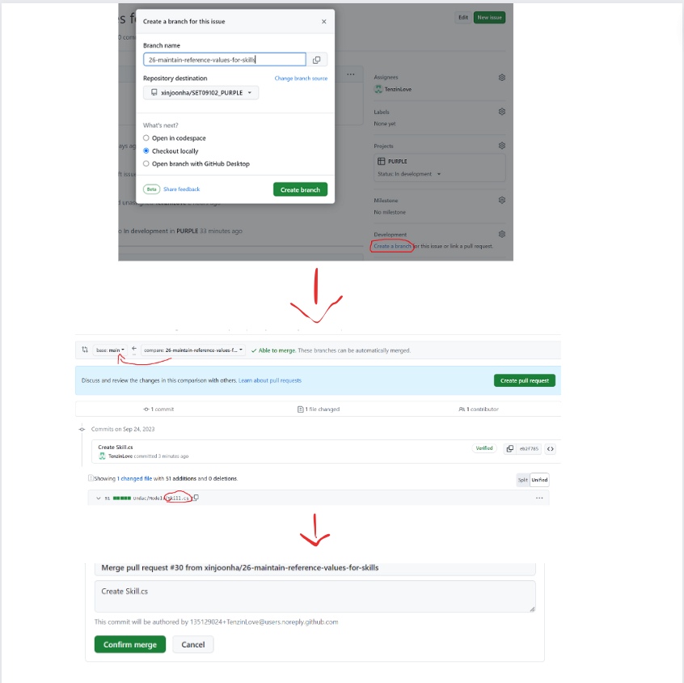

# Workflow

This section documents your practical work in week 3.

The main requirements are to show that:

1. You know how to use the workflow tools in GitHub
2. You have successfully carried out the required operations which are:
   * Accept a task from the project backlog
   * Update the task information appropriately
   * Update the task board appropriately
   * Complete the development task on a feature branch
   * Commit your changes with appropriate comments
   * Check your work against the Definition of Done (DoD)
   * Make a pull request

## Task workflow

Firstly, each person assigns themselves to a task to allow everyone to know who is doing what.

Then, everyone puts the progress of their task: task not started, in progress, finished as we can see 
in the photo above.

We see the progress of each with mine boxed: 

After, I created a new branch to have all the elements of the main project and to have the possibility 
to work on my task without changing the main project. 

Then, once the task has progressed, I made a pull request in the main project to share my work with
the group.

Finally, when my task was completed I merged it in the main project. So, there is a new folder 
in the main project, the folder I created.

Each step are visible in the next photo : 

## Reflection

For my task, I had some difficulties with the database. So, I created a new database for my task specificly.

The way we work is good if we are alone. But I think it can quickly get messy and the grouping of all the 
work confuses most people.
